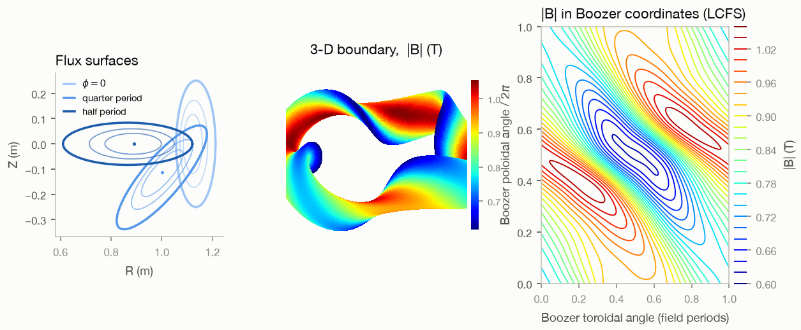
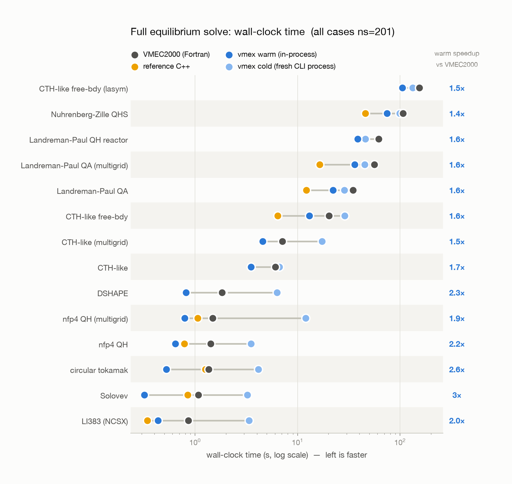

# VMEX

VMEX is a JAX implementation of VMEC for stellarator and tokamak ideal-MHD equilibria. It reads standard VMEC input files, solves fixed- and free-boundary problems, writes standard `wout_*.nc` files, and provides exact implicit derivatives of converged fixed-boundary equilibria for optimization.



## Install

```console
pip install vmex
vmex --doctor
vmex --test
```

Python 3.10+ is supported. VMEX installs CPU JAX, SciPy, plotting, NetCDF, and `booz_xform_jax`; install an accelerator-enabled JAX wheel separately using the [JAX installation guide](https://docs.jax.dev/en/latest/installation.html). Optional integrations are `vmex[optimizers]` for JAXopt/Optax, `vmex[freeb]` for differentiable virtual casing, `vmex[coils]` for ESSOS, and `vmex[turbulence]` for GKX.

An editable source install remains connected to its checkout, so `pip install -e .` only needs to be repeated when packaging metadata or dependencies change—not after each `git fetch` or checkout.

## Solve and inspect an equilibrium

```python
import vmex as vj

inp = vj.VmecInput.from_file("input.circular_tokamak")
result = vj.solve_multigrid(inp, verbose=True)
wout = vj.wout_from_state(inp=inp, state=result.state,
                           fsqr=result.fsqr, fsqz=result.fsqz, fsql=result.fsql,
                           niter=result.iterations, converged=result.converged)
vj.write_wout("wout_circular_tokamak.nc", wout)
vj.plot_wout("wout_circular_tokamak.nc", "figures")
```

The CLI provides the same workflow:

```console
vmex input.circular_tokamak
vmex --plot wout_circular_tokamak.nc
```

VMEX uses the input file's `NS_ARRAY`, `FTOL_ARRAY`, and `NITER_ARRAY`. `verbose=True` prints the VMEC iteration table; typed errors distinguish invalid inputs, Jacobian failures, non-convergence, and numerical failures.

## Hot restart

Pass a previous state or wout to initialize a nearby run. VMEX adapts the boundary and skips completed multigrid rungs when possible.

```python
base = vj.solve_multigrid(inp)
nearby = vj.solve_multigrid(changed_input, initial_state=base.state)
from_file = vj.solve_multigrid(changed_input, restart_from="wout_base.nc")
```

Optimization trial solves hot-restart automatically. See the [restart guide](https://vmex.readthedocs.io/en/latest/howto/restart-from-previous-run.html) for grid changes and validation rules.

## Optimizer-neutral problems

Objective tuples use `(function, target, weight)`, with `weight` multiplying the squared cost by default. The resulting problem works directly with SciPy, JAXopt, Optax, or a user optimizer.

```python
from dataclasses import replace
import jax.numpy as jnp
import numpy as np
from scipy.optimize import least_squares

from vmex import optimize as opt
from vmex.core.omnigenity import QIResidual

max_mode = 5
mpol = max(max_mode + 2, 5)
inp = replace(inp, delt=0.5).change_resolution(
    mpol=mpol, ntor=mpol, ntheta=2 * mpol + 6, nzeta=2 * mpol + 4)
qi = QIResidual(np.linspace(0.1, 1.0, 6))

def iota_floor(state, runtime):
    return jnp.maximum(0.33 - jnp.abs(opt.mean_iota(state, runtime)), 0.0)

problem = opt.VmecProblem.from_tuples(inp, [
    (qi, 0.0, 1.0),
    (opt.aspect_ratio, 5.0, 0.005),
    (iota_floor, 0.0, 10.0),
], max_mode=max_mode, use_ess=True)

result = least_squares(problem.residual, problem.x0,
    jac=problem.residual_jac, x_scale=problem.scales, max_nfev=50, verbose=2)
optimized_input = problem.input_from_x(result.x)
optimized_equilibrium = problem.equilibrium_from_x(result.x)
```

The defaults are exact implicit derivatives, automatic Jacobian direction, one-column Jacobian batches, hot restarts, and cost weights. Advanced controls include:

- `derivative_method="finite_difference"` for opaque host objectives;
- `implicit_jacobian_method` and `jacobian_batch_size` for response assembly and memory/compile tradeoffs;
- `forward_ftol` and `forward_max_iterations` for the final forward-solve stage;
- `max_fsq_ratio` for the largest under-converged `FSQ / ftol` that may be differentiated;
- `workers` for parallel finite differences, scans, and ensembles. `None` uses the CPUs available to the process and respects scheduler or container limits.

`problem.value_and_grad` and `problem.jax_value_and_grad` expose the same scalar contract. `problem.evaluate(x)` reports solve effort, failed trials, derivative fallbacks, `fsq`, `fsq_ratio`, and whether the implicit derivative was certified. The runnable examples show SciPy least squares, BFGS/L-BFGS-B, JAXopt, Optax Adam, QI/QS objectives, high-accuracy final solves, input/wout output, and plotting.

## Physics and interoperability

VMEX includes VMEC pressure/current/iota profiles, multigrid continuation, NESTOR free boundary, mgrid and direct coil fields, Boozer transforms, QI/QS and maximum-J objectives, Mercier and ballooning diagnostics, bootstrap-current objectives, dimensional scaling, mirror equilibria, and standard wout/mout output. The [capability reference](https://vmex.readthedocs.io/en/latest/reference/capabilities.html) states the validation level and limitations of each path.

VMEX outputs are intended for existing VMEC workflows: `wout_*.nc` files load in SIMSOPT, `booz_xform`, and other downstream tools. VMEC2000 compatibility and deliberate differences are documented in the [compatibility reference](https://vmex.readthedocs.io/en/latest/reference/vmec2000-compatibility.html).

## Performance and parallelism

JAX compilation is paid once per array structure and reused from a machine-local cache. Warm runs are the relevant measure for continuation, parameter scans, and optimization.



Independent solves use `vj.parallel.solve_ensemble(inputs, workers=None)`. A single equilibrium already uses XLA's internal threading; ensemble workers are therefore bounded by both the number of cases and the CPUs made available by the host scheduler. Explicit `workers=1` gives a reproducible serial baseline, and GPU/device placement can be selected with `device=`.

Reproducible performance artifacts live in `benchmarks/`; `benchmarks/optimization.py` profiles QI, QA, QH, QP, scalar objectives, SciPy/JAX contract agreement, finite differences, optimizer choices, and the `max_fsq_ratio` policy without committing machine-specific scans or decorative plots.

## Documentation and development

The [documentation](https://vmex.readthedocs.io/) is organized as tutorials, task-focused how-to guides, API/reference pages, and numerical explanations. Start with:

- [first equilibrium](https://vmex.readthedocs.io/en/latest/tutorials/first-equilibrium.html)
- [first gradient](https://vmex.readthedocs.io/en/latest/tutorials/first-gradient.html)
- [first optimization](https://vmex.readthedocs.io/en/latest/tutorials/first-optimization.html)
- [optimization reference](https://vmex.readthedocs.io/en/latest/reference/optimization.html)
- [objectives reference](https://vmex.readthedocs.io/en/latest/reference/objectives.html)
- [parallel and HPC usage](https://vmex.readthedocs.io/en/latest/howto/parallel-ensembles.html)

For development:

```console
git clone https://github.com/uwplasma/vmex
cd vmex
pip install -e ".[dev]"
pytest -q -m "not full and not weekly"
python -m ruff check vmex tests examples benchmarks
```

See [contributing](https://vmex.readthedocs.io/en/latest/project/contributing.html), the [test manifest](tests/manifest.json), and the [changelog](docs/project/changelog.md). VMEX is released under the MIT license.
