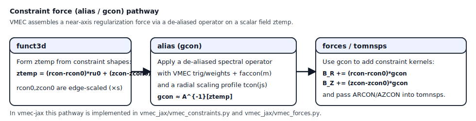

Algorithms
==========

This page documents the numerical building blocks currently implemented, and
the intended path to a VMEC-quality solver.

Discretization summary
----------------------

Radial grid
~~~~~~~~~~~

We use a uniform grid in :math:`s \in [0,1]` with ``ns`` points:

.. math::

   s_j = \frac{j}{ns-1},\qquad j=0,\dots,ns-1.

VMEC2000 uses a mix of full-mesh and half-mesh conventions in ``s``; ``vmec-jax``
currently treats most quantities on a full mesh for simplicity, and ports
half-mesh logic as needed for parity (notably in ``wout`` regressions).

Angular grids
~~~~~~~~~~~~~

We use uniform tensor-product grids in :math:`\theta` and :math:`\zeta` (one
field period):

- :math:`\theta_i = 2\pi i / ntheta`
- :math:`\zeta_k = 2\pi k / nzeta`

These grids are represented by ``AngleGrid`` and built in
``vmec_jax/grids.py``.

Fourier transforms
~~~~~~~~~~~~~~~~~~

VMEC uses Fourier transforms between mode space and real space on the angular
grid. In ``vmec-jax`` we currently implement synthesis using dense basis
tensors:

.. math::

   f(\theta,\zeta) = \sum_{m,n} \Bigl(
     c_{mn}\cos(m\theta-n\zeta) + s_{mn}\sin(m\theta-n\zeta)
   \Bigr).

This is implemented with ``einsum`` for both NumPy and JAX.

Future work:

- FFT-based transforms to reduce memory and runtime for larger mode counts.

Step-1/2 geometry pipeline
--------------------------

The geometry kernel is the foundation of most downstream physics:

1. Evaluate :math:`(R,Z,\lambda)` on the ``(s,theta,zeta)`` grid from Fourier
   coefficients (``eval_coords``).
2. Compute angular derivatives analytically in mode space
   (``eval_fourier_dtheta``, ``eval_fourier_dzeta_phys``).
3. Compute radial derivatives by finite differences on coefficient arrays
   (``d_ds_coeffs``), then re-synthesize.
4. Embed in Cartesian coordinates using :math:`\phi_{\mathrm{phys}} = \zeta/\mathrm{NFP}`.
5. Compute covariant metric elements and signed Jacobian ``sqrtg`` (``eval_geom``).

The goal is that each step is differentiable and jittable.

Step-3 profiles and volume integrals
------------------------------------

Profiles
~~~~~~~~

VMEC supports several profile parameterizations. ``vmec-jax`` currently
implements:

- ``power_series`` for pressure (``AM``), iota (``AI``), and current function (``AC``).

This is enough to validate many basic equilibria and match a subset of VMEC
inputs.

Future work:

- pedestal logic parity (beyond the minimal clamp already implemented),
- spline and tabulated profiles,
- correct handling of the ``gamma != 0`` “mass profile” pathway (pressure derived
  from the volume profile).

Volume profile
~~~~~~~~~~~~~~

Given ``sqrtg(s,theta,zeta)`` we compute:

- ``dV/ds`` by integrating over angles,
- ``V(s)`` by a cumulative trapezoid in ``s``.

This is implemented in ``vmec_jax/integrals.py``.

Step-4 field and energy
-----------------------

We compute contravariant field components ``(bsupu, bsupv)`` using:

- ``sqrtg``,
- 1D flux functions ``(phipf, chipf)``,
- scaled lambda derivatives multiplied by ``lamscale``.

We validate against ``wout`` Nyquist Fourier coefficients for ``sqrtg`` and
``bsup*`` and integrate to obtain ``wb``.

Step-10 parity building blocks: forces, transforms, and constraints
------------------------------------------------------------------------

VMEC's reported force residual scalars (``fsqr``, ``fsqz``, ``fsql``) are
computed from *Fourier-space* force arrays produced by a specific sequence of
real-space kernels and transforms. Reproducing these conventions is necessary
for true output parity with VMEC2000.

Near-axis conventions matter. VMEC enforces mode-dependent axis rules via the
``jmin1``/``jmin2`` tables (see ``vmec_params.f``). In particular, odd-m internal
fields satisfy:

- for ``m=1``: extrapolate the internal odd field to the axis (copy ``js=2``),
- for ``m>=2``: internal odd fields are zero on the axis.

In this repo we apply this rule by splitting the odd-m contribution into an
``m=1`` part and an ``m>=3`` part before converting from physical
``sqrt(s)*odd_internal`` to ``odd_internal``.

Force kernel combination (tomnsps)
~~~~~~~~~~~~~~~~~~~~~~~~~~~~~~~~~~

VMEC forms real-space "kernel" arrays and combines them into Fourier-space force
arrays via ``tomnsps``. Conceptually, the residuals have the form:

.. math::

   F_R &= A_R - \partial_u B_R + \partial_v C_R, \\
   F_Z &= A_Z - \partial_u B_Z + \partial_v C_Z, \\
   F_\lambda &=      - \partial_u B_\lambda + \partial_v C_\lambda,

where :math:`u=\theta` and :math:`v=\phi_{\mathrm{phys}}`.

In VMEC2000 this is not done with a plain FFT. Instead the code uses:

- symmetry-aware theta sizes ``ntheta1/2/3``,
- endpoint-weighted quadrature tables (``cosmui/sinmui``),
- mode normalization scalings (``mscale/nscale``),
- derivative tables that include the field-period scaling (:math:`n\,\mathrm{NFP}`).

In ``vmec-jax`` these conventions are implemented in:

- ``vmec_jax.vmec_tomnsp`` (``fixaray``-style trig/weight tables + a vectorized ``tomnsps`` core)

Constraint pipeline (alias / gcon)
~~~~~~~~~~~~~~~~~~~~~~~~~~~~~~~~~~

VMEC includes a constraint force that is assembled via an ``alias`` operator.
In the fixed-boundary pathway (see VMEC2000 ``funct3d.f`` and ``alias.f``),
VMEC forms a scalar field:

.. math::

   z_{\mathrm{temp}}(s,\theta,\zeta)
   =
   \bigl(r_{\mathrm{con}} - r_{\mathrm{con},0}\bigr)\,r_{\theta,0}
   +
   \bigl(z_{\mathrm{con}} - z_{\mathrm{con},0}\bigr)\,z_{\theta,0},

then computes :math:`g_{\mathrm{con}}` by applying a de-aliased spectral operator
that (schematically) resembles:

.. math::

   g_{\mathrm{con}} \;\approx\; \mathcal{A}^{-1}\!\left[z_{\mathrm{temp}}\right],

with an ``m``-dependent multiplier

.. math::

   \mathrm{xmpq}(m,1) = m(m-1),

and a constraint filter coefficient (VMEC ``faccon``):

.. math::

   \mathrm{faccon}(m)
   =
   -\frac{1}{4}\,\frac{\mathrm{signgs}}{\mathrm{xmpq}(m+1,1)^2},
   \qquad m=1,\dots,(\mathrm{mpol}-2).

VMEC's actual discrete operator uses the precomputed trig tables and an
additional surface-dependent scaling ``tcon(js)`` computed in VMEC's ``bcovar``.

In ``vmec-jax`` we port the discrete ``alias`` operator in:

- ``vmec_jax.vmec_constraints`` (``alias_gcon``).

   Schematic of VMEC's ``alias``/``gcon`` constraint-force pathway as implemented in ``vmec-jax``.

At present, ``tcon(js)`` is computed from a JAX port of the diagonal
``precondn`` contribution used by VMEC's ``bcovar.f`` for the constraint scaling,
with a conservative heuristic fallback that matches VMEC's scaling structure
(``tcon0`` dependence and the :math:`(32\,hs)^2` factor). This is sufficient to
exercise the full ``alias`` / constraint-force pathway under ``jit``; it is not
yet expected to be perfect parity with VMEC's full preconditioner machinery.

Step-5 lambda solve (inner solve)
---------------------------------

Holding ``(R,Z)`` fixed, we minimize ``wb`` with respect to lambda coefficients.
This is a useful subproblem and is part of VMEC’s nonlinear solve.

``vmec-jax`` implements a robust baseline method:

- gradient descent in coefficient space,
- backtracking line search enforcing monotone decrease,
- gauge fixing of the ``(m,n)=(0,0)`` lambda mode.

This is implemented in ``solve_lambda_gd``.

Experimental VMEC-residual solvers (not yet VMEC2000-parity)
------------------------------------------------------------

For end-to-end work we also provide *experimental* solvers that minimize a
VMEC-style residual objective built from the Step-10 parity kernels:

.. math::

   W_{\mathrm{res}}(\mathbf{x})
   =
   w_{\mathrm{rz}}\left(\lVert F_R \rVert^2 + \lVert F_Z \rVert^2\right)
   +
   w_{\lambda}\lVert F_\lambda \rVert^2,

where :math:`\mathbf{x}` stacks the Fourier coefficients for
:math:`(R,Z,\lambda)`.

Two variants exist:

1. ``solve_fixed_boundary_lbfgs_vmec_residual`` minimizes :math:`W_{\mathrm{res}}`
   using a simple L-BFGS loop with backtracking line search.
2. ``solve_fixed_boundary_gn_vmec_residual`` treats :math:`W_{\mathrm{res}}` as a
   least-squares problem and applies a Gauss-Newton step:

   .. math::

      (J^\top J + \mu I)\,\Delta\mathbf{x} = -J^\top \mathbf{r},

   where :math:`\mathbf{r}` is the stacked residual vector and :math:`J` its Jacobian.
   We apply conjugate gradients to the normal equations using JAX ``jvp/vjp`` to
   form matrix-vector products without materializing :math:`J`.

Both residual solvers can optionally include VMEC's constraint force
(``include_constraint_force=True``), using the scalar input parameter ``TCON0``.

Current limitations (important)
~~~~~~~~~~~~~~~~~~~~~~~~~~~~~~~

These solvers are primarily intended as a *development harness* for parity work.
They are **not** yet guaranteed to converge to the VMEC2000 equilibrium from an
arbitrary initial guess, because:

- the Step-10 force kernels were originally ported for *output parity on a converged equilibrium*,
  and are still being hardened for use as a general-purpose nonlinear solver objective;
- VMEC's full nonlinear iteration includes additional iteration-dependent logic,
  preconditioner-dependent scalings (``fnorm``/``fnormL``), and axis/constraint details
  that are not fully reproduced yet.

In other words: decreasing :math:`W_{\mathrm{res}}` is a useful milestone and a
regression target, but it is not yet equivalent to "match VMEC2000 coefficients".

Step-6/7 fixed-boundary solve (early stage)
-------------------------------------------

We extend the optimization variables to include all Fourier coefficients:

- interior surfaces: evolve ``R/Z/λ``,
- boundary surface (``s=1``): hold ``R/Z`` fixed (prescribed boundary),
- axis surface (``s=0``): enforce basic regularity by zeroing all ``m>0`` ``R/Z`` coefficients,
- lambda: enforce gauge and axis row constraints.

Two optimizers are currently provided:

1. Gradient descent + backtracking (``solve_fixed_boundary_gd``)
2. L-BFGS + backtracking (``solve_fixed_boundary_lbfgs``)

These are **not** yet VMEC-quality. In VMEC2000, the “right” approach is to:

- evaluate force residuals (not just energy),
- apply strong preconditioning in Fourier × radial space,
- use VMEC’s tailored time-stepping / Richardson-like evolution with Jacobian-based safeguards.

Roadmap to VMEC-quality parity
------------------------------

The main missing pieces for parity are:

1. **Force residuals**:
   - full MHD force balance in VMEC coordinates,
   - correct half-mesh/full-mesh placement of terms.

2. **Preconditioning**:
   - mode-space block/diagonal scaling,
   - radial block-tridiagonal structure (VMEC’s strongest preconditioner).

3. **Nonlinear solve strategy**:
   - implement VMEC’s evolution strategy or a robust quasi-Newton with good preconditioner,
   - add Jacobian sign and axis-guess recovery logic.

4. **Implicit differentiation**:
   - replace backprop through iterations with a custom VJP based on the implicit function theorem.
