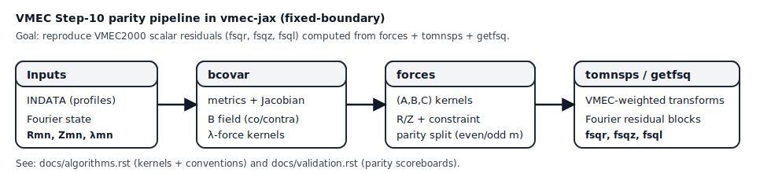
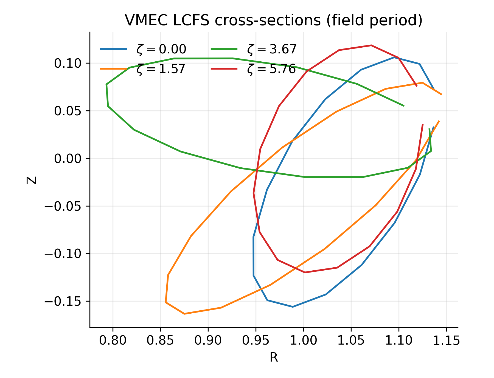
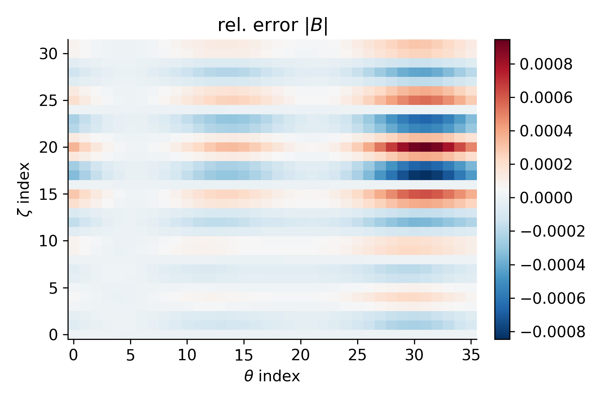
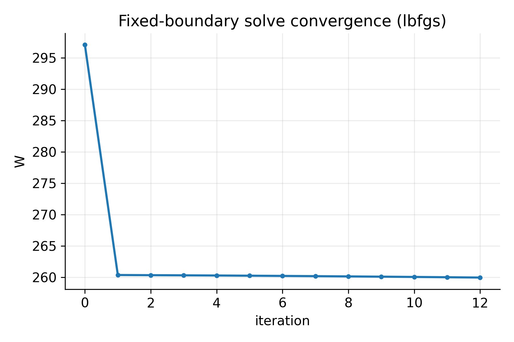

Overview
========

What is VMEC?
-------------

VMEC (Variational Moments Equilibrium Code) computes 3D ideal-MHD equilibria in
toroidal geometry by representing flux surfaces with Fourier series and solving
a fixed-boundary equilibrium problem. The canonical public reference
implementation is **VMEC2000** (Fortran).

VMEC is widely used in stellarator/heliotron physics and in tokamak applications
where 3D features matter (e.g. ripple, RMPs, 3D shaping).

What is vmec-jax?
-----------------

``vmec-jax`` is a from-scratch Python package that ports the core VMEC ideas to
JAX:

- vectorized numerical kernels (``jax.numpy`` + ``jit``),
- automatic differentiation for gradients w.r.t. Fourier coefficients and inputs,
- a stepwise porting strategy with regression tests.

The goal is to enable fast prototyping of equilibrium solvers, robust
integration into optimization loops, and differentiable “physics-in-the-loop”
workflows.

   The Step-10 parity pipeline used for regressions against VMEC2000 (fixed-boundary).

   Example output: last-closed flux surface (LCFS) cross-sections at several
   toroidal slices within one field period.

Side-by-side VMEC2000 vs vmec_jax comparisons for the n3are case are generated
by ``examples/visualization/n3are_vmec2000_vs_vmecjax.py`` (see README for a
quick preview).

   Example output: relative error in reconstructed ``|B|`` compared to the
   bundled VMEC2000 ``wout`` reference (a typical Step-10 parity diagnostic).

   Example output: fixed-boundary solver energy convergence on a small case
   (illustrative; solver parity vs VMEC2000 is still in progress).

Scope (current)
---------------

This repo is validated through step 7 of the port plan:

- Step 0–2: geometry kernels up through metric/Jacobian (``sqrt(g)``).
- Step 3: input profiles + volume integrals.
- Step 4: contravariant magnetic field and magnetic energy (``wb``) matching ``wout``.
- Step 5: lambda-only solve (R/Z fixed).
- Step 6: basic fixed-boundary solve (R/Z/lambda) with monotone energy decrease.
- Step 7: an L-BFGS fixed-boundary solve variant (no external deps).

The solver is *not yet VMEC-quality* (i.e. not a drop-in replacement for
VMEC2000): we still need VMEC’s full force-balance residual and its
preconditioners for robust fast convergence.

Initial guess
-------------

vmec_jax initializes the Fourier coefficients with VMEC-style regularity:
``rho = sqrt(s)`` scaling for ``m>0`` modes and a linear blend between axis
and boundary for ``m=0`` R coefficients when axis inputs are provided. This
matches the VMEC2000/VMEC++ convention and improves stability of early
iterations in fixed-boundary solves.

When axis inputs are not provided, vmec_jax now performs a VMEC++-style
axis recomputation: it searches each toroidal plane for the axis position
that maximizes the minimum Jacobian proxy, using VMEC's reduced theta grid
and normalization tables. This provides a much more robust initial axis
guess and reduces geometric pathologies in early iterations.

For diagnostics, vmec_jax also exposes a VMEC-style real-space pipeline
(`vmec_realspace_geom_from_state` + `vmec_half_mesh_jacobian_from_state`)
that mirrors VMEC's odd-m representation and half-mesh Jacobian formulas.

Design principles
-----------------

Minimal dependencies
~~~~~~~~~~~~~~~~~~~~

Core runtime:

- ``numpy`` (required)
- ``jax`` + ``jaxlib`` (optional, but required for differentiation and performance)

Optional:

- ``netCDF4`` for reading ``wout_*.nc`` regression data.

Clear JIT boundaries
~~~~~~~~~~~~~~~~~~~~

In JAX, compilation dominates runtime for “small” problems. We therefore:

- make frequently-used containers into PyTrees (``VMECState``, ``HelicalBasis``, ``Geom``),
- keep static precomputations in ``VMECStatic``,
- provide solver toggles (``jit_grad``) to trade compile latency vs per-iteration speed.

Regression-first development
~~~~~~~~~~~~~~~~~~~~~~~~~~~~

We treat VMEC2000 ``wout_*.nc`` files as ground truth for intermediate quantities:

- Fourier mode ordering and normalization,
- ``sqrt(g)`` (Nyquist expansion) and B-field coefficients,
- scalar integrals like ``wb`` and total volume.

Once intermediate parity is achieved, tolerances can be tightened and work can
move “upstream” toward forces and the full nonlinear solve.
