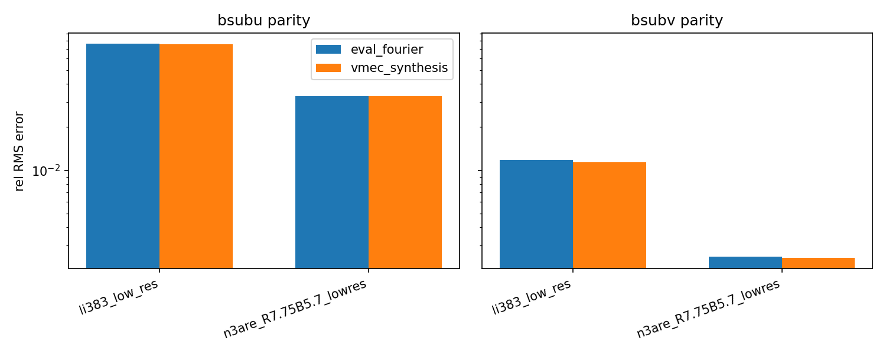

Validation and regression testing
=================================

``vmec-jax`` is developed using a regression-first workflow: each porting step
introduces a small kernel and validates it against VMEC2000 outputs (typically
via ``wout_*.nc``).

Bundled regression cases
------------------------

The repo includes several small, low-resolution reference cases used in examples
and tests:

- Axisymmetric tokamak sanity case (vacuum):
  - ``examples/data/input.circular_tokamak`` + ``examples/data/wout_circular_tokamak_reference.nc``

- Additional axisymmetric fixed-boundary cases:
  - ``examples/data/input.circular_tokamak_aspect_100`` + ``examples/data/wout_circular_tokamak_aspect_100_reference.nc``
  - ``examples/data/input.purely_toroidal_field`` + ``examples/data/wout_purely_toroidal_field_reference.nc``
  - ``examples/data/input.ITERModel`` + ``examples/data/wout_ITERModel_reference.nc``

- 3D stellarator-symmetric finite-beta case:
  - ``examples/data/input.li383_low_res`` + ``examples/data/wout_li383_low_res_reference.nc``

- Additional 3D stellarator-symmetric fixed-boundary cases:
  - ``examples/data/input.LandremanSengupta2019_section5.4_B2_A80`` + ``examples/data/wout_LandremanSengupta2019_section5.4_B2_A80_reference.nc``
  - ``examples/data/input.n3are_R7.75B5.7_lowres`` + ``examples/data/wout_n3are_R7.75B5.7_lowres.nc``

- Deferred (``lasym=True``) cases bundled for later parity work:
  - ``examples/data/input.LandremanSenguptaPlunk_section5p3_low_res`` + ``examples/data/wout_LandremanSenguptaPlunk_section5p3_low_res_reference.nc``
  - ``examples/data/input.up_down_asymmetric_tokamak`` + ``examples/data/wout_up_down_asymmetric_tokamak_reference.nc``

What is validated today
-----------------------

The tests in ``tests/`` cover:

- correct INDATA parsing,
- boundary evaluation and agreement with the ``s=1`` state surface,
- metric/Jacobian positivity and shape checks,
- stepwise regressions vs ``wout`` (Nyquist ``sqrt(g)``, ``bsup*``, energy integrals ``wb/wp``).
- Step-10 scalar residual parity for VMEC-style ``forces``/``tomnsps``/``getfsq``.
- VMEC convention checks used by Step-10 kernels (e.g. ``chipf -> chips`` inversion and ``equif`` normalization parity).
- Constraint-force pipeline pieces (``tcon`` scaling + ``alias`` bandpass operator).
- an early end-to-end regression that a Gauss-Newton residual solver decreases a VMEC-style residual objective on ``input.circular_tokamak`` (this is *not* yet a full VMEC2000 equilibrium-parity solve).

Step-10 parity status (fsqr/fsqz/fsql)
--------------------------------------------------

The current Step-10 parity regression compares the scalar residuals computed by
``vmec-jax`` against those stored in bundled VMEC2000 ``wout_*.nc`` reference
files, using the same internal VMEC angle grid conventions:

.. math::

   \texttt{bcovar} \rightarrow \texttt{forces} \rightarrow \texttt{tomnsps} \rightarrow \texttt{getfsq}.

The scoreboard below reports relative errors
:math:`|\hat f - f|/\max(|f|,\epsilon)` for each scalar:

.. list-table::
   :header-rows: 1
   :widths: 28 18 18 18

   * - Case
     - fsqr rel. err
     - fsqz rel. err
     - fsql rel. err
   * - circular_tokamak
     - ~5.6e-5
     - ~7.1e-5
     - ~1.0e-6
   * - li383_low_res
     - ~1.3e-3
     - ~4.4e-3
     - ~1.4e-5
   * - circular_tokamak_aspect_100
     - ~8.4e-7
     - ~6.6e-7
     - ~2.3e-7
   * - purely_toroidal_field
     - ~1.3e-4
     - ~2.6e-4
     - ~1.9e-7
   * - ITERModel
     - ~3.5e-5
     - ~1.7e-5
     - ~2.5e-6
   * - LandremanSengupta2019_section5.4_B2_A80
     - ~1.1e-6
     - ~2.5e-6
     - ~9.0e-9
   * - n3are_R7.75B5.7_lowres
     - ~6.4e-6
     - ~2.7e-5
     - ~9.1e-10

Notes:

- A key VMEC convention is that after ``tomnsps``, VMEC scales the Fourier-space
  forces by ``scalxc`` (constructed in ``profil3d.f``) before calling
  ``residue/getfsq`` (see ``funct3d.f``). ``vmec-jax`` now applies this scaling
  by default when computing ``fsqr/fsqz/fsql``.
- ``lasym=True`` parity (non-stellarator-symmetric) is deferred for now; the
  bundled lasym cases are excluded from automated validation until the
  ``tomnspa`` conventions are reconciled.
- For 3D stellarator-symmetric cases with ``nfp>1`` (notably ``li383_low_res`` and
  ``n3are``), ``bsup*`` parity is tight on the VMEC internal grid, while
  ``bsub*`` shows O(1–8%) RMS gaps. This points to a remaining mismatch in the
  VMEC real-space synthesis / half-mesh metric conventions rather than the
  contravariant field construction itself.
  A before/after summary for the VMEC synthesis path is in
  ``docs/_static/figures/bsub_parity_before_after.png`` (generated by
  ``examples/validation/bsub_parity_before_after_plot.py``).
  External VMEC2000 runs with ``examples/validation/external_vmec_driver_compare.py --metrics``
  show that the eval_fourier and VMEC synthesis metric pieces agree to ~1e-16,
  so the remaining gap is likely tied to covariant field normalization rather
  than the raw metric construction.
  The breakdown script ``examples/validation/bsub_parity_breakdown.py`` confirms:

  - ``bsup*`` parity is tight (O(1e-13)) for the 3D cases.
  - ``bsub*`` parity errors are unchanged whether we use eval_fourier or VMEC synthesis.
  - ``bsub*`` errors match the metric-only reconstruction
    (``bsub = g_uu B^u + g_uv B^v``),
    pointing to a remaining half-mesh metric / parity convention mismatch.
- For debugging/attribution during the parity push, ``vmec_jax.vmec_residue``
  provides ``vmec_fsq_sums_from_tomnsps`` (per-block sum-of-squares) and a
  small internal-consistency regression in ``tests/test_step10_getfsq_block_sums.py``.
- These numbers are expected to change as parity improves; the authoritative
  regression is ``tests/test_step10_residue_getfsq_parity.py``.

Feature parity matrix (selected)
--------------------------------

Parity figures
--------------

The following figures live in ``docs/_static/`` and are referenced here (not in
the README) so parity diagnostics remain co-located with validation notes.

.. figure:: _static/step10_pipeline.svg
   :width: 90%
   :alt: VMEC Step-10 parity pipeline

   The VMEC-style parity pipeline used in regression tests:
   ``bcovar → forces → tomnsps → getfsq``.

.. figure:: _static/figures/bmag_parity_error.png
   :width: 80%
   :alt: B magnitude parity error

   Pointwise relative error in B magnitude versus bundled VMEC2000 ``wout`` references
   on the Nyquist grid.

   bsub parity before/after switching to VMEC real-space synthesis for 3D
   symmetric cases (``li383`` and ``n3are``). The parity gap persists, implying
   the remaining mismatch is in half-mesh metric conventions rather than the
   synthesis path.

The table below summarizes parity at a feature level. “OK” indicates coverage
by the test suite (typically via bundled ``wout`` regressions); “Partial”
indicates known gaps or loose tolerances.
Scope note: validation currently targets **stellarator-symmetric / up-down
symmetric** cases (``lasym=False``). Asymmetric equilibria (``lasym=True``) and
free-boundary / parallel workflows are planned but not implemented yet.

.. list-table::
   :header-rows: 1
   :widths: 30 18 18 28

   * - Area
     - Axisym (ntor=0)
     - 3D (lasym=F)
     - Notes
   * - Boundary + geometry kernels
     - OK
     - OK
     - ``sqrt(g)`` + Nyquist fields validated vs ``wout``; energy integrals ``wb/wp`` match (see ``tests/test_step10_energy_integrals_parity.py``)
   * - B-field parity (``bsup*``, ``bsub*``, ``|B|``)
     - OK
     - Partial
     - ``bsup*`` and ``|B|`` tight; ``bsub*`` still shows O(1–8%) RMS gaps for some nfp>1 cases
   * - ``wout`` I/O (read + minimal write)
     - OK
     - OK
     - ``tests/test_step10_wout_roundtrip.py``
   * - Step-10 scalar residuals (``fsqr/fsqz/fsql``)
     - OK
     - OK
     - tracked by ``tests/test_step10_residue_getfsq_parity.py`` (bundled symmetric cases)
   * - Fixed-boundary solvers
     - Partial
     - Partial
     - monotone energy decrease; VMEC-quality convergence is WIP
   * - Implicit differentiation demos
     - OK
     - OK
     - examples under ``examples/gradients/``
   * - Free-boundary equilibrium
     - Planned
     - Planned
     - not implemented
   * - Up-down / stellarator asymmetry (``lasym=True``)
     - Planned
     - Planned
     - deferred
   * - Parallelization (multi-device)
     - Planned
     - Planned
     - not implemented

Known gaps and workplan
-----------------------

Known gap (symmetric, 3D): ``bsub*`` parity for some ``nfp>1`` cases (notably
``li383_low_res`` and ``n3are``) is still at O(1-8%) RMS even when ``bsup*`` parity
is tight. This suggests a mismatch in **real-space synthesis + half-mesh metric**
conventions rather than the contravariant field construction itself.

Immediate plan:
1. VMEC-style ``totzsp`` synthesis (``fixaray`` trig/weight tables + reduced theta grid) for R/Z/L and derivatives is now wired into ``bcovar`` (``use_vmec_synthesis=True``).
2. Recompute ``bsub*`` parity on 3D cases using the VMEC synthesis path and update parity figures.
3. Tighten ``tests/test_step10_bsub_parity.py`` tolerances once the RMS error drops.
4. Continue VMEC++ stage parity with ``examples/validation/vmecpp_stage_parity_pipeline.py`` and ``examples/validation/vmecpp_getfsq_decomposition.py`` to localize the first solver-stage mismatch before changing update rules.
5. Use ``examples/validation/vmecpp_bsub_metric_probe.py`` to decompose the remaining ``bsub*`` gap and identify whether the mismatch is dominated by ``g_uu``, ``g_uv`` or ``g_vv`` pathways.

Running tests::

  pytest -q

If you do not have ``netCDF4`` installed, tests that require ``wout`` I/O will be
skipped.

Constraint pipeline diagnostics
--------------------------------

To inspect the fixed-boundary constraint force pipeline against an external
VMEC2000/VMEC++ ``wout_*.nc`` file, use::

  python examples/validation/constraint_pipeline_report.py input.case wout_case.nc

This report prints ``tcon``/``gcon`` summaries and compares the VMEC-style
``fsqr/fsqz/fsql`` scalars computed by ``vmec-jax`` against the supplied
``wout``.

VMEC++ stage diagnostics
------------------------

For stage-by-stage parity against a fresh VMEC++ run, use::

  python examples/validation/vmecpp_stage_parity_pipeline.py --input examples/data/input.n3are_R7.75B5.7_lowres

Use ``--hi-res`` only for exploratory diagnostics; by default this script uses
the input-grid angular resolution for VMEC-consistent ``getfsq`` checks.

The stage gate uses a looser ``bsub`` threshold (``4e-2``) than ``bsup`` so
that diagnostics do not repeatedly stop on the known few-``1e-2`` ``bsubu``
gap while we tighten solver-update parity.

For focused residual-scalar convention checks (`getfsq`) on the VMEC++ final
state, use::

  python examples/validation/vmecpp_getfsq_decomposition.py --input examples/data/input.n3are_R7.75B5.7_lowres

To isolate the current ``bsub`` mismatch on the VMEC++ final state and quantify
which metric pathway dominates it, use::

  python examples/validation/vmecpp_bsub_metric_probe.py --input examples/data/input.n3are_R7.75B5.7_lowres

The script writes a JSON report with:

- outer-surface relative RMS for ``bsup*`` and ``bsub*``,
- decomposition terms for ``bsubu``/``bsubv``,
- implied metric deltas (holding the cross-term fixed) to attribute residuals.

Current finding (n3are):

- ``bsup*`` parity is tight (few ``1e-3`` or better),
- ``bsubu`` remains the first failing block (few ``1e-2``),
- the dominant inferred mismatch is in the ``g_uu`` pathway (not ``g_vv``).
- with ``use_wout_bsup=True``, using direct Nyquist Fourier evaluation for
  reference ``bsup*`` (instead of VMEC synthesis tables) tightens the
  self-consistency ``getfsq`` residuals by ~2 orders of magnitude.

To compare VMEC++ internal ``jxbout`` arrays directly against vmec_jax
``bcovar`` fields (with explicit VMEC internal-grid reshaping), run::

  python examples/validation/vmecpp_jxbout_compare.py --input examples/data/input.n3are_R7.75B5.7_lowres

This report includes three views:

- ``field_stats``: vmec_jax vs VMEC++ ``jxbout``,
- ``wout_eval_vs_jxbout``: pure ``wout``-Fourier evaluation vs ``jxbout``,
- ``vmec_jax_vs_wout_eval``: vmec_jax vs ``wout``-Fourier evaluation.

Current finding (n3are):

- vmec_jax vs ``wout``-Fourier remains tight for ``sqrtg``/``bsup*`` and at the
  known few-``1e-2`` level for ``bsubu``,
- VMEC++ ``jxbout`` vs ``wout``-Fourier differs at the ``1e-1`` level for
  ``bsup*``/``bsub*`` on this case.
- with the current fixed-boundary constraint path enabled (``indata/TCON0``
  passed through ``vmec_forces_rz_from_wout``), the VMEC++ self-consistency
  stage now passes geometry/``bsup``/``bsub``/``getfsq`` gates on n3are.
- the next mismatch is in the iterative update path (initial and short
  ``vmecpp_iter`` runs remain far from the VMEC++ final state).

So the first practical parity target remains the VMEC2000/``wout`` path used by
existing tests; ``jxbout`` is kept as an internal cross-check rather than a
strict stage gate.

Residual decomposition diagnostics
----------------------------------

To break the VMEC-style residuals into component-only norms (``A``/``B``/``C``
vs constraint terms) and see which ``(m,n)`` modes dominate the current parity
gaps, use::

  python examples/validation/residual_decomposition_report.py input.case wout_case.nc

The report prints component-only norms (note: they do not sum because
cross-terms are omitted), plus the top ``(m,n)`` contributors for ``gcr/gcz/gcl``.

Reference vs full-field comparison
----------------------------------

To compare the residual contributions from the reference-field path (using
``wout``-stored ``bsup*``/``bsub*``/``|B|``) against the fully derived
``vmec-jax`` field path, use::

  python examples/validation/residual_compare_fields_report.py input.case wout_case.nc

This report prints deltas for component-only norms (A/B/C/constraint/lambda) and
the most significant ``(m,n)`` differences between the two paths.

Current fixed-boundary solve status (n3are)
-------------------------------------------

- Visualization parity for the initial guess path is now stable, including the
  3D ``|B|`` rendering (same Jacobian-floor stabilization as the 2D ``|B|``
  surface plot).
- ``vmecpp_iter`` now uses a bounded per-iteration time step derived from force
  RMS to avoid immediate overflow/NaN updates.
- ``vmecpp_iter`` now applies force updates in VMEC++-style ``(m,n>=0)``
  storage before mapping into vmec_jax's signed-helical state layout.
- Iteration logs now include ``dt_eff`` and ``update_rms`` in addition to
  ``fsqr/fsqz/fsql`` to help locate the first unstable update step.
- Solver-update parity is still in progress: short runs can reduce residuals by
  orders of magnitude but remain non-monotone and far from VMEC2000/VMEC++ final
  fixed-boundary solutions on n3are.

Optional: validating against a local VMEC2000 build
---------------------------------------------------

If you have **VMEC2000** available via its Python extension (``import vmec``),
the test suite includes an optional integration parity test that:

- runs VMEC2000 to produce a ``wout_*.nc`` file for a small bundled case, then
- checks that ``vmec-jax`` reproduces VMEC’s Step-10 scalar residuals
  (``fsqr/fsqz/fsql``) on the same case.

This test is skipped by default and is also skipped automatically if ``vmec``,
``mpi4py``, or ``netCDF4`` are not available.

To run the integration tests locally::

  VMEC2000_INTEGRATION=1 pytest -q -m vmec2000

Optional: validating against VMEC++
-----------------------------------

If you have VMEC++ installed (``vmecpp`` Python package) you can run an
integration smoke test that produces a ``wout_*.nc`` file and compares it to
the bundled VMEC2000 reference data::

  VMECPP_INTEGRATION=1 pytest -q -m vmecpp

For ad-hoc comparisons (including vmec_jax B-field parity metrics), use::

  python examples/validation/external_vmec_driver_compare.py --backend vmecpp --case circular_tokamak

The same script can drive a local VMEC2000 Python build if available::

  python examples/validation/external_vmec_driver_compare.py --backend vmec2000 --case circular_tokamak

Notes:

- VMEC2000’s Python extension depends on the system ``libnetcdf`` shared
  library (in addition to ``netCDF4``/``mpi4py``). If ``import vmec`` fails with
  a missing ``libnetcdf`` error, install the OS-level NetCDF package.
- VMEC++ uses OpenMP internally; if you see crashes or oversubscription issues,
  try setting ``OMP_NUM_THREADS=1`` and pass ``--max-threads 1`` to the helper
  script.

Note
----
The VMEC2000 sources under **STELLOPT/VMEC2000** are more up-to-date than the
minimal ``vmec2000`` folder. When in doubt about numerics, use the STELLOPT copy
as the primary reference and treat the minimal VMEC2000 checkout as a
lightweight regression baseline.
